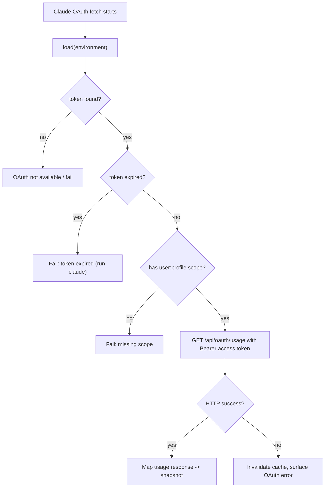
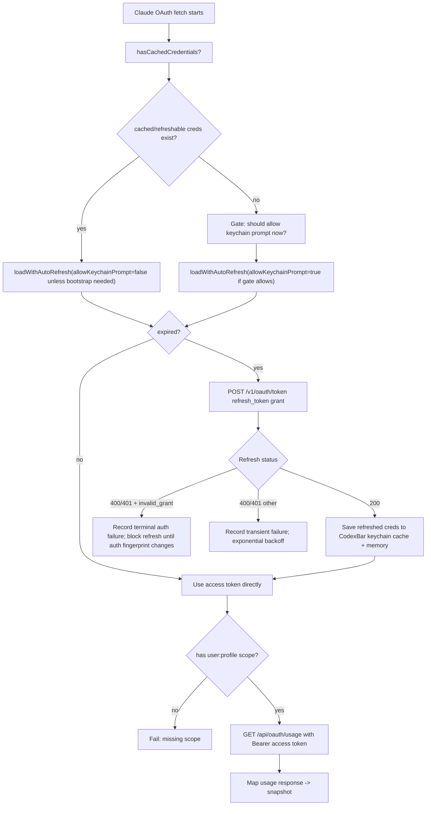
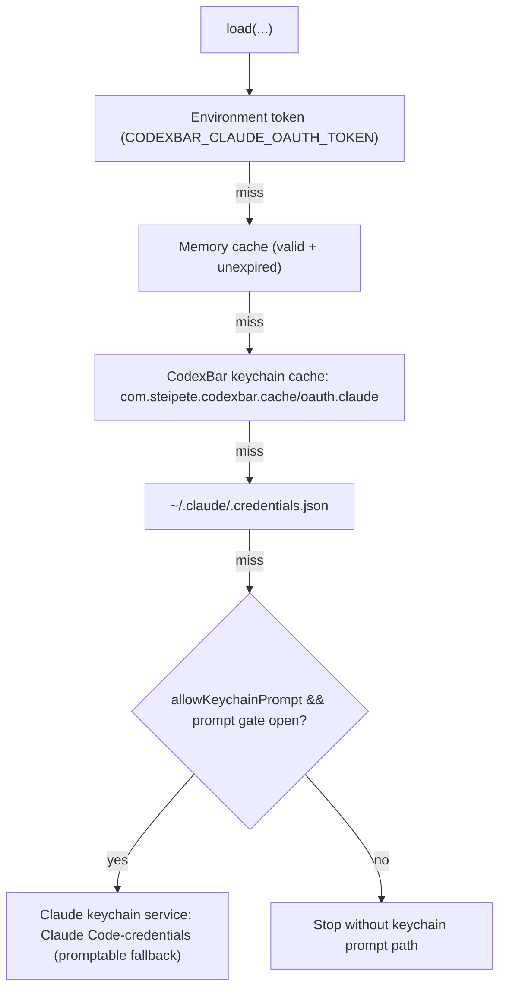
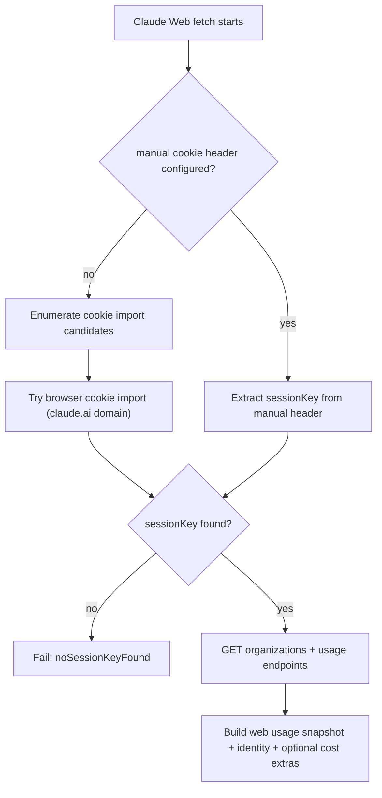
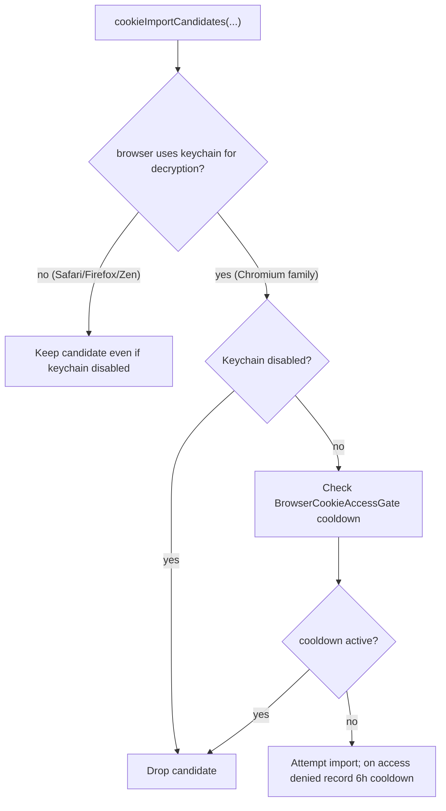
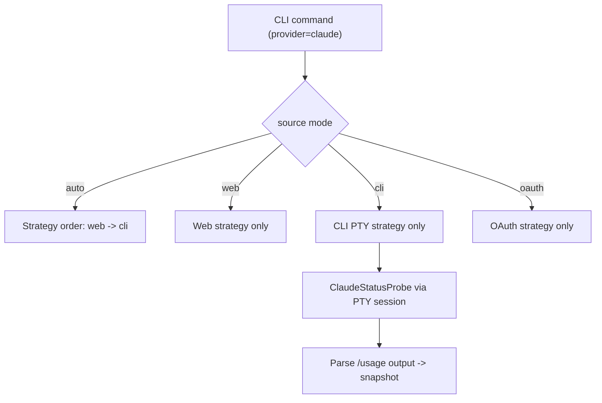
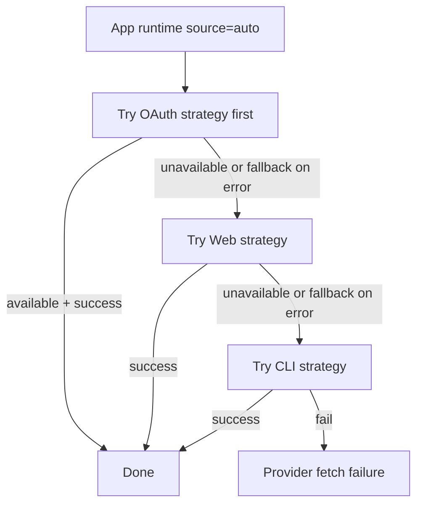
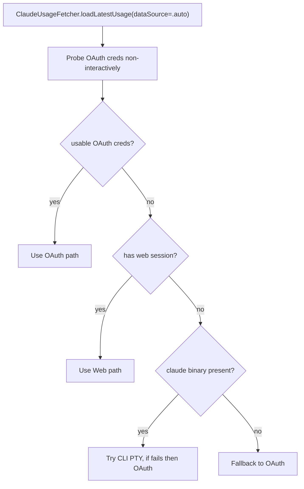
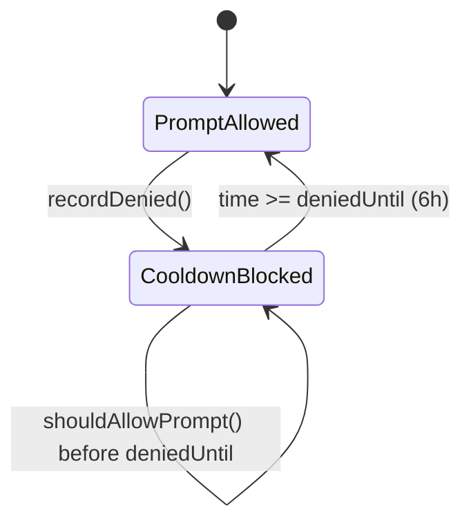
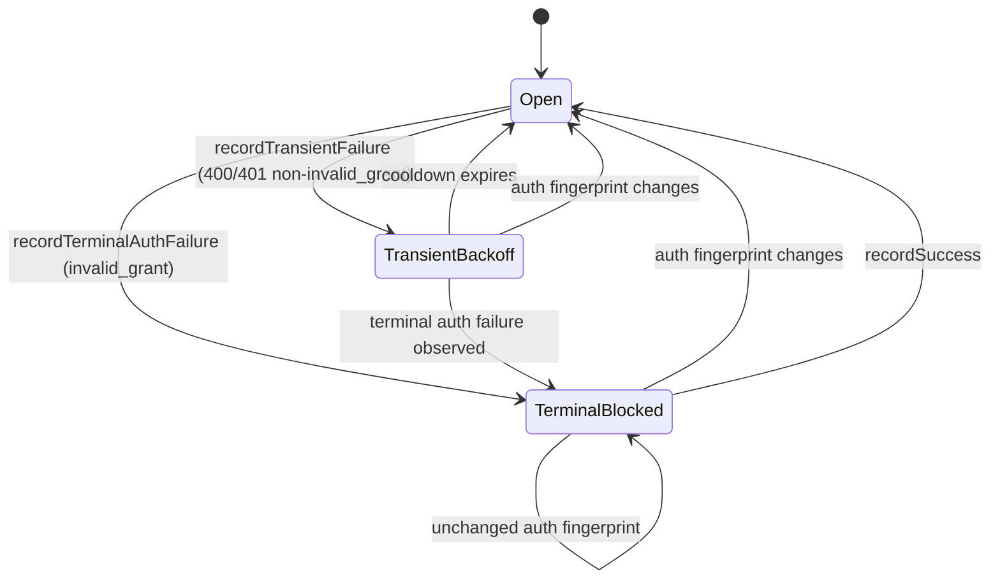

# Claude Fetch Comparison (`7b79b2d` vs `HEAD`)

This document compares Claude data fetching behavior between:
- Baseline commit: `7b79b2d080c6b00f6c8f52f89ac115f33a7ca8b0`
- Current `HEAD`: `37841489f849567a598d2a8ba601eb6f1228644e`

Focus areas:
- OAuth
- Web
- CLI
- Keychain permission prompts, cooldowns, and re-prompt behavior
- OAuth token fetch/use/refresh behavior

## High-level Changes

- OAuth moved from "load token and fail if expired" to "auto-refresh when expired".
- Claude keychain reads now use stricter non-interactive probes (`kSecUseAuthenticationUIFail`) before any promptable path.
- New Claude keychain prompt cooldown gate: 6-hour suppression after denial.
- New OAuth refresh failure gate:
  - `invalid_grant` => terminal block until auth fingerprint changes.
  - repeated `400/401` (non-`invalid_grant`) => transient exponential backoff (up to 6h).
- Auto-mode availability checks were hardened to avoid interactive prompts where possible.

## OAuth Flow

### OAuth (Before: `7b79b2d`)

### OAuth (Now: `HEAD`)

### OAuth Token Source Resolution (Now)

## Web Flow

### Web (Before and Now: core fetch path largely unchanged)

### Web Candidate Filtering + Prompt Implications (Now)

## CLI Flow

### CLI Fetch Path (Provider Runtime = `.cli`)

Notes:
- The PTY parsing path itself is functionally stable in this range.
- Claude CLI session environment still scrubs OAuth env overrides and `ANTHROPIC_*` vars before launching the subprocess.

## App Runtime Auto Pipeline (Provider Fetch Plan)

### App Auto Strategy Order (Descriptor Pipeline)

### Internal `ClaudeUsageFetcher(dataSource:.auto)` Heuristic (Now)

## Keychain Prompt / Re-prompt Behavior

### Claude OAuth Keychain Prompt Gate (Now)

### OAuth Refresh Failure Gate (Now)

## Key Differences in Permission Prompt Surfaces

- Before:
  - OAuth availability/load paths could reach Claude keychain access with less strict non-interactive protection.
  - No dedicated Claude OAuth prompt cooldown gate.
  - No terminal-vs-transient refresh failure gate.
- Now:
  - Non-interactive probes are stricter and reused broadly.
  - Promptable Claude keychain access is gated and usually only bootstrap-oriented.
  - Denials cause cooldown suppression to avoid repeated prompts.
  - Refresh failures can suppress repeated attempts until either timeout (transient) or credential change (terminal).

## Related Files

- `/Users/ratulsarna/Developer/staipete/CodexBar/Sources/CodexBarCore/Providers/Claude/ClaudeUsageFetcher.swift`
- `/Users/ratulsarna/Developer/staipete/CodexBar/Sources/CodexBarCore/Providers/Claude/ClaudeProviderDescriptor.swift`
- `/Users/ratulsarna/Developer/staipete/CodexBar/Sources/CodexBarCore/Providers/Claude/ClaudeOAuth/ClaudeOAuthCredentials.swift`
- `/Users/ratulsarna/Developer/staipete/CodexBar/Sources/CodexBarCore/Providers/Claude/ClaudeOAuth/ClaudeOAuthKeychainAccessGate.swift`
- `/Users/ratulsarna/Developer/staipete/CodexBar/Sources/CodexBarCore/Providers/Claude/ClaudeOAuth/ClaudeOAuthRefreshFailureGate.swift`
- `/Users/ratulsarna/Developer/staipete/CodexBar/Sources/CodexBarCore/KeychainAccessPreflight.swift`
- `/Users/ratulsarna/Developer/staipete/CodexBar/Sources/CodexBarCore/KeychainNoUIQuery.swift`
- `/Users/ratulsarna/Developer/staipete/CodexBar/Sources/CodexBarCore/BrowserCookieImportOrder.swift`
- `/Users/ratulsarna/Developer/staipete/CodexBar/Sources/CodexBarCore/BrowserCookieAccessGate.swift`
